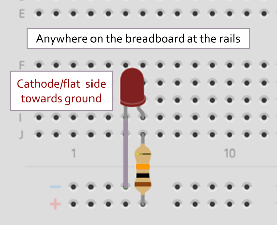

import { Steps } from '@astrojs/starlight/components';

## Make an LED light up on a breadboard! 
<Steps>
1. Ask a PI at front desk for a half or full sized breadboard and two male-to-male wires! 
2. Go to Benchtop 3 and get <u>one</u> 10kΩ resistor. Go to Benchtop 8 and choose an LED from the top row of the left drawers and <u>two</u> alligator clips from the bottom row of the left drawers. *(If you don't know where that is or are having issues with locating anything, ask a PI at front desk!)*
3. Find an open benchtop to get setup! 
4. Grab two banana plug cables from the cable rack: one red for power and one black for ground. *(While red and black are the standard colors, you can technically use any color cables if all the red and black ones are gone.)*
5. Build the following circuit with each of the male-to-male jumpers on one of the rails. *(If you are having any issues, ask a PI at front desk!)* 

6. Put alligator clips on one side of each of the banana cables and connect the other side to the power supply putting 5V into the circuit. 
7. Show your circuit with the LED on to a front desk PI to get a stamp! 
</Steps>