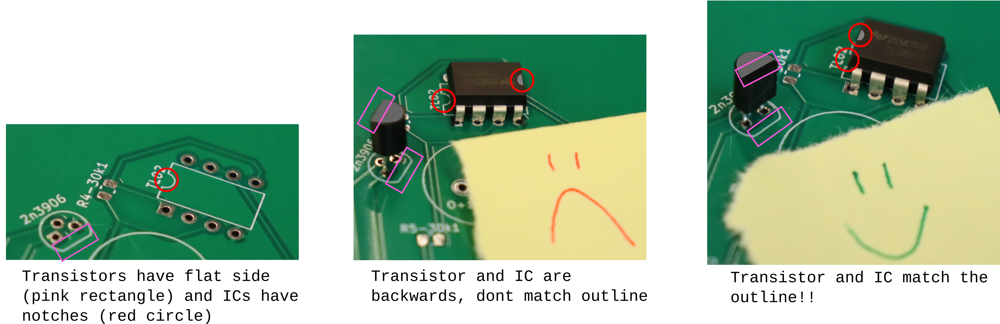

## Solder a workshop board!
1. Ask a PI at front desk for a soldering kit
2. If the kit does NOT have all the components, grab the components listed on the PCB from Benchtop 8, as well as some solder (choose one of the smaller diameters). Ask a PI if you need help finding anything!
3. Go to a benchtop and turn on the soldering iron:
    a. Make sure the power switch is flipped on (red is showing, screen turns on)
    b. Select an iron by pressing 1, 2, or 3. You want the one with a pointy tip.
    c. Press the left and right arrows simultaneously to turn on the iron. A blue ring should illuminate on the iron.
    d. Adjust the temperature to be around 350-375 F.
4. Place in one component, bending the legs before soldering it. Ask a PI if you have never soldered before.
Note that some components have a specific orientation, namely ICs and transistors: 

5. Continue adding components. When you've added all the components, ask a PI to check your work and guide you through testing the board.
6. Turn off the soldering iron.
7. Show your soldering to a front desk PI to get a stamp!