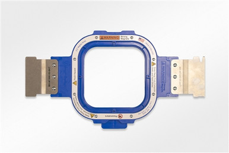

Make an embroidered Hive patch
1. Obtain a piece of fabric (scrap bins ok)
2. Grab a Mighty Hoop, if the drawer is locked, please go to front desk.

3. Cut a piece of tearaway backing paper (located underneath the machine)
4. Hoop the fabric
5. Load hoop into machine
6. Go to embroidery computer
7. Load [Hex-Design]
8. Get a embroidery trained PI to help you embroider your patch
9. Show your new patch to a front desk PI to get a stamp!