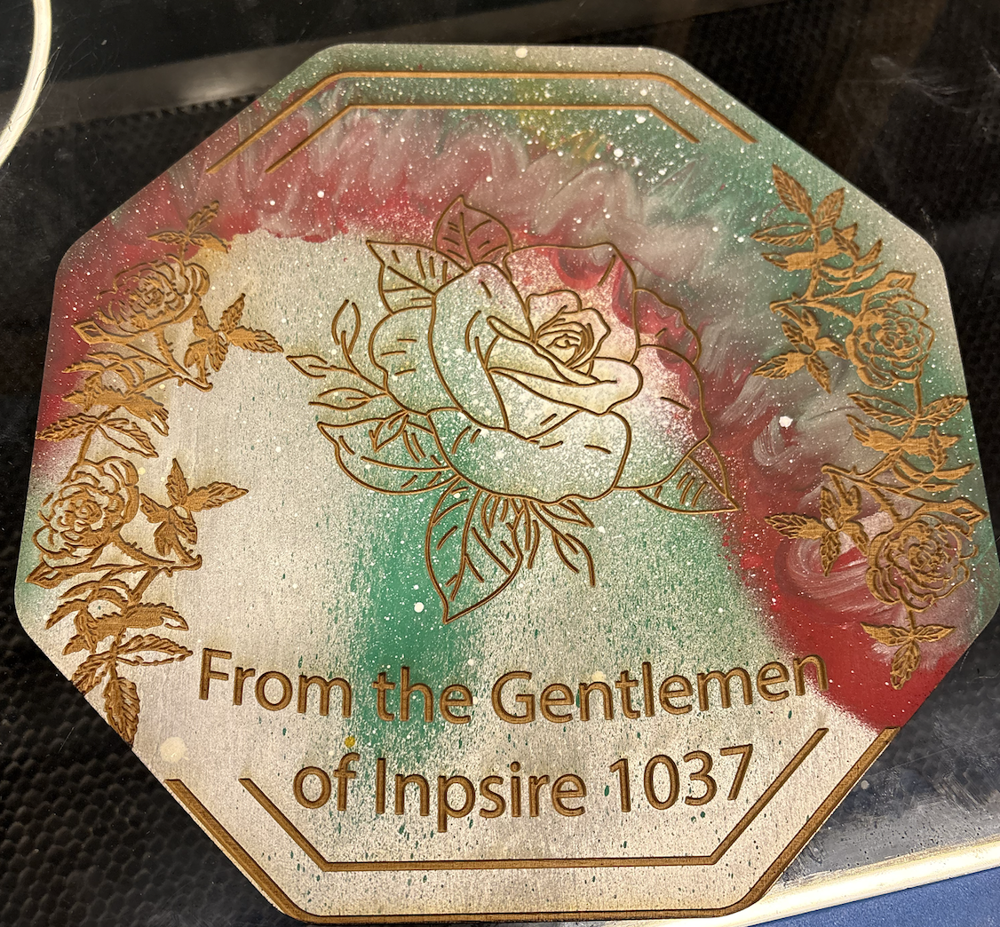

import { Steps } from '@astrojs/starlight/components';

## Spray paint wood then laser cut a line art image onto it to create something cool!
<Steps>
1. Use the spray-painting room to add whatever colors you want onto the material, it can be one or many, whatever works with your ideas. 
2. As it is drying work in Adobe illustrator to make your design, be creative the options are limitless! 
    a. Remember that if the machine engraves a part of the image at any power (aka if it's not pure white), it’ll take off the paint so maybe try using line art. 
3. Cut and engrave the material like normal, the paint doesn’t affect the depth of the cut significantly.
4. Show your new design to a front desk PI to get a stamp!
</Steps>

*Here are some examples but try your own ideas. It's a great niche way to use laser cutters!*
