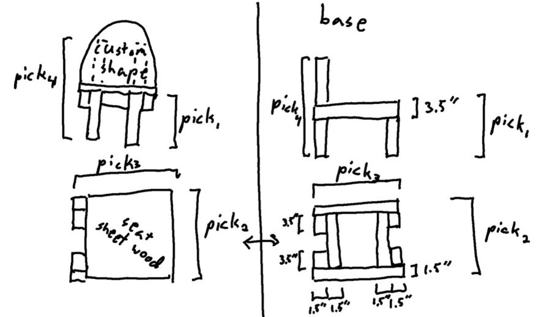

import { Steps } from '@astrojs/starlight/components';

## Build a chair
<Steps>
1. Make sure you have someone else in the room with you. 
2. This is a rough design for your chair.

3. Figure out how much material you need for your dimensions.
4. Assemble! Use the miter saw to cut your 2x4, the bandsaw to cut the seat, and a jigsaw to cut the back of the chair.
5. Make sure you put away your tools when done.
6. Show your new chair to a front desk PI to get a stamp!
</Steps>
